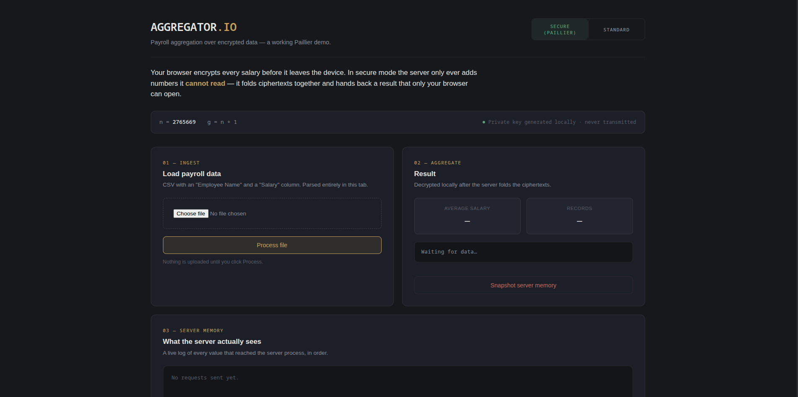
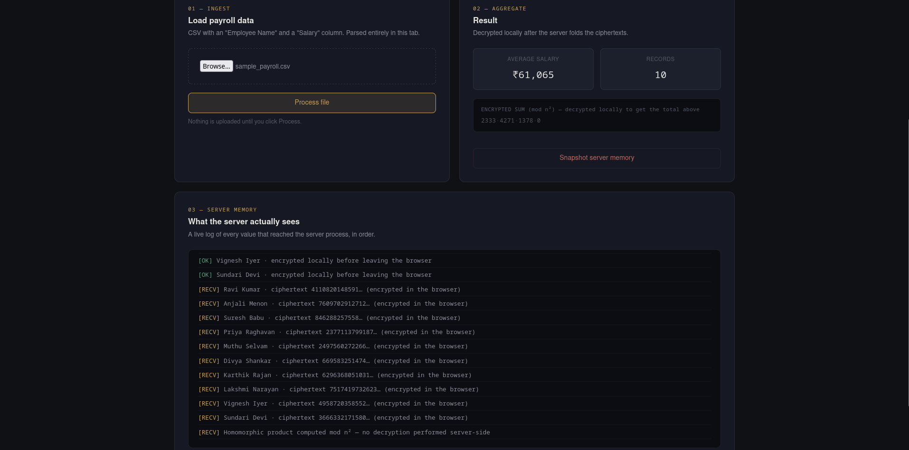
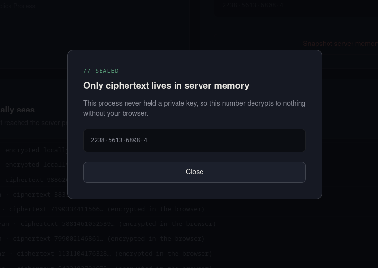
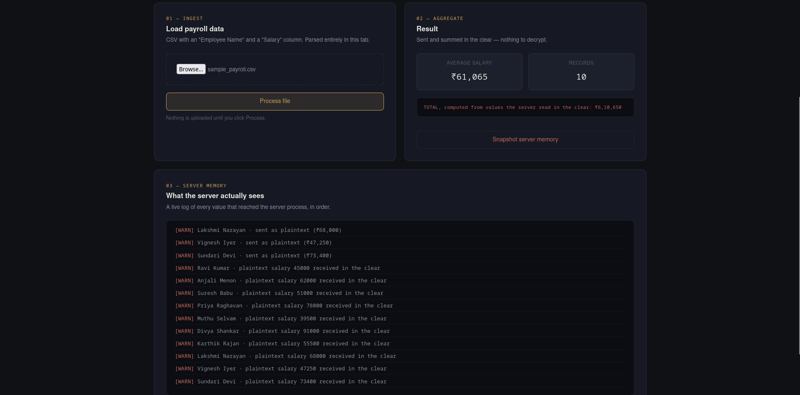
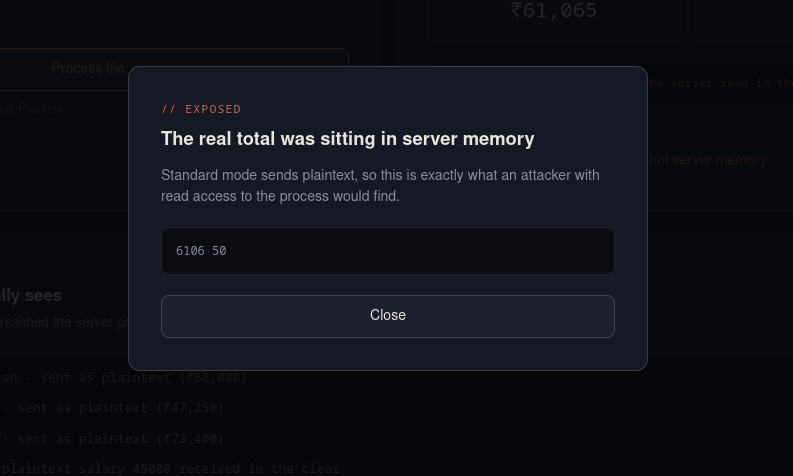

# AGGREGATOR-IO


Payroll aggregation over encrypted data. A working demonstration of the Paillier homomorphic
cryptosystem, implemented from scratch, showing what a server can and cannot see depending on
how data reaches it.

## Overview

Most systems that compute an aggregate value, an average salary across a team, for example,
require the server to see every individual value first. This project demonstrates an alternative:
salaries are encrypted in the browser before they are sent anywhere, and the server computes the
sum by operating directly on ciphertext, using the homomorphic property of the Paillier
cryptosystem. It never holds a private key and, in secure mode, never sees a plaintext salary.

The application exposes two modes side by side so the difference is visible rather than assumed:

- **Standard mode** sends salaries in the clear, the way a naive implementation would.
- **Secure mode** sends only Paillier ciphertexts. The server folds them together with modular
  multiplication and returns a result that only the originating browser can decrypt.

A "Snapshot server memory" control reads the live server process state on demand, so the
difference between the two modes can be inspected directly rather than taken on faith.

## How it works

1. The browser generates a Paillier keypair on page load. The private key is held only in a
   local JavaScript variable and is never transmitted.
2. In secure mode, each salary is encrypted client-side before the request is sent. The raw CSV
   never leaves the browser.
3. The server receives ciphertexts and the public modulus, and computes the encrypted sum using
   modular multiplication, homomorphic addition under Paillier. It performs no decryption.
4. The browser decrypts the returned sum locally to display the total and average.
5. The memory snapshot control returns whatever the server process is currently holding. In
   secure mode this is an undecryptable ciphertext; in standard mode it is the real plaintext
   total.

## Screenshots

Screenshots are stored in `docs/screenshots/`.

### Landing page


Initial state in secure mode, before any file has been processed. Shows the header, the public
key strip, and the empty ingestion and aggregate panels.

### Secure mode result


After processing a CSV in secure mode. The aggregate panel shows the decrypted total and average,
the grouped ciphertext ledger, and a server log where every line shows an encrypted value.

### Secure mode memory snapshot


Result of the "Snapshot server memory" control while in secure mode. The server has only a
ciphertext to show, and no private key with which to open it.

### Standard mode result


The same CSV processed in standard mode. The server log now shows each plaintext salary as it
was received.

### Standard mode memory snapshot


Result of the memory snapshot control in standard mode, showing the real total sitting in server
memory in the clear.

## Tech stack

- **Backend:** Python, Flask
- **Frontend:** HTML, CSS, vanilla JavaScript (BigInt for arbitrary-precision modular arithmetic)
- **Cryptography:** Paillier cryptosystem, implemented from scratch, no external crypto library

## Getting started

### Prerequisites

- Python 3.9 or later

### Installation

```
git clone https://github.com/<your-username>/<your-repo>.git
cd <your-repo>
pip install flask
python app.py
```

Visit `http://localhost:5000` in a browser.

### CSV format

The uploaded file needs a `Salary` column. An `Employee Name` column is optional and used only
for labeling log entries.

```
Employee Name,Salary
Ravi Kumar,45000
Anjali Menon,62000
Suresh Babu,51000
```

## Project structure

```
.
├── app.py
├── templates/
│   └── index.html
├── docs/
│   └── screenshots/
│       ├── landing.png
│       ├── secure-result.png
│       ├── secure-snapshot-sealed.png
│       ├── standard-result.png
│       └── standard-snapshot-leak.png
└── README.md
```

## Security notes and limitations

This is a demonstration project, not a production cryptography library. Specifically:

- The primes behind the Paillier modulus are intentionally small (64-bit) so that key generation
  is instant and logged ciphertexts stay short enough to read. A production deployment would use
  2048-bit or larger primes through a vetted library such as `python-paillier`, not a from-scratch
  implementation.
- Server state is held in a single process-wide variable, which is sufficient for a single-user
  demo but would need to be session-scoped for concurrent users.
- CSV parsing is a simple comma split and does not handle quoted fields containing commas.

## Author

Built by [Abhishek Nair J](https://github.com/abhishek475)
